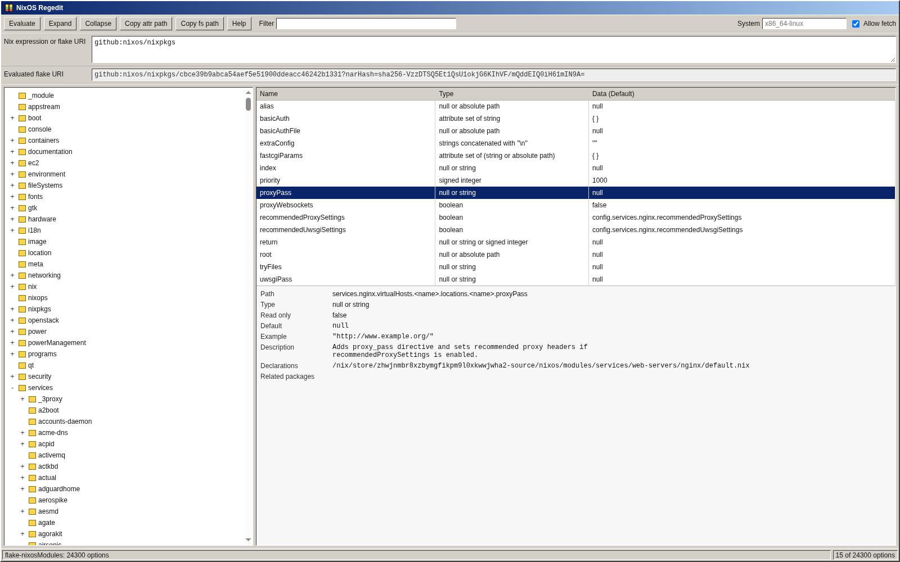

# NixOS Regedit



Single-page browser for NixOS module options, presented with a Registry Editor-style interface.

Use the published standalone app at:

<https://johnrichardrinehart.github.io/nixos-regedit/>

Build it with:

```sh
nix build --builders ''
```

Then open `result/index.html` in a browser.

To run the local Python-backed server instead:

```sh
nix run
```

`nix run .#backend` is the same server entrypoint. The `.#standalone` package is
the single-file browser artifact, and `.#libeval-wasm` is the reusable WASM
evaluator package embedded by that artifact.

The app accepts one source value: a Nix expression or flake URI. Bare flake URIs
default to `#nixosModules.default`; explicit selectors such as `github:owner/repo#foo`
are allowed when that output has the right shape. The selected output, or an
arbitrary expression, must evaluate to a NixOS module, a list of NixOS modules,
or an attribute set whose values are NixOS modules.
If a bare flake URI has no `#nixosModules.default`, the evaluator falls back to
`flake.lib.nixosSystem` or `flake.inputs.nixpkgs.lib.nixosSystem` when available,
then to `nixos/modules/module-list.nix` when that file exists. If the default
output exists, the evaluator renders that module through the same `nixosSystem`
path when available so NixOS-specific module assumptions work. If the default
output exists but is not a usable module value, evaluation fails instead of
falling back.

Example expression:

```nix
{
  default = { lib, ... }: {
    options.demo.enable = lib.mkEnableOption "demo";
  };
}
```

Fetching is disabled by default. Enable the UI checkbox when a flake reference or expression needs network access.
The backend can use the local `nix` command to fetch ordinary flake sources such
as GitHub. The standalone page is still subject to browser CORS rules, so remote
archives that are not CORS-readable from local pages need the backend app or a
CORS-readable source with Allow fetch enabled.

The standalone browser UI does not call an HTTP backend. Evaluation is provided
by libeval-wasm through the app integration exposed as
`window.NixOSRegeditEvaluator`.

## Reusable libeval-wasm

The Nix evaluator is available separately as:

```sh
nix build --builders '' .#libeval-wasm
```

That package installs `share/libeval-wasm/libeval.js`.
It is an Emscripten `SINGLE_FILE` module exporting
`createLibevalWasm()`. Other browser apps can load it and call
`module.cwrap("libeval_wasm", "string", ["string"])` to evaluate a Nix
expression to a JSON string.

NixOS Regedit consumes this package when building the standalone HTML bundle.
See `docs/libeval-wasm.md` for the ABI and storage integration notes.

## License

MIT.

### Generated-code note

This project was developed with OpenAI's Codex CLI. OpenAI's public terms and
help-center guidance state that, as between you and OpenAI, you own generated
output to the extent permitted by law, and that OpenAI does not claim ownership
of API-generated output. That means the project can be published under MIT, while
still requiring the usual care for any vendored code, upstream notices, or
third-party assets.

Sources:

- <https://openai.com/policies/terms-of-use/>
- <https://help.openai.com/en/articles/5008634-who-owns-the-output-created-by-chatgpt>
